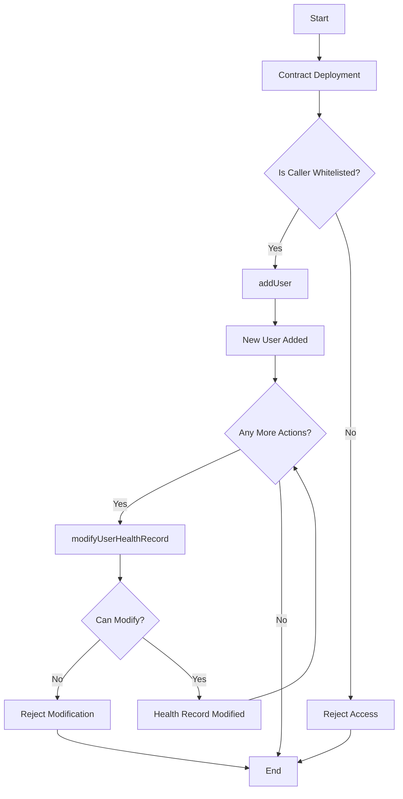

# ethglobal-istanbul23-smart-health-data

## Short description
Smart Health Data DAPP is designed to support UNICEF in helping migrating. By iris scan technology a unique personal ID is created, replacing conventional documentation. Our DAPP ensures the access to patient’s records only with explicit consent and the encrypted storage of data

## Long description

We built a DAPP to support unicef in health care management of climate refugees. Due to the climate change, we are observing human migrations on large scale, so millions of children around the world are on the move from their homes to other countries and this can multiply risks for them. They may be separated from their families and displacement can disrupt access to primary services, like health care, exposing children to disease and inadequate immunization. In this scenario, UNICEF call to action is to recognise the connection between human mobility and climate change, protect children from the impacts of climate change and displacement by ensuring child-critical services, strengthening data systems leveraging innovative technologies to guarantee health care services. Our response to UNICEF call to action is Smart Health Data. Smart Health Data DAPP is designed to support UNICEF in helping migrating children across different countries, it ensures information storage, unique identification of the user and user control. By iris scan technology, a unique personal ID is created, replacing all conventional documentation. This system ensures the access to patient’s records only with explicit consent and the encrypted storage of data. Our DAPP is made by these components: deployed contract on scroll chain, connection with wallet connect web3modal, verification of user address uniqueness with worldcoinID, upload of health record data using lighthouse storage of filecoin. In addition it is possible to connect smart health data to DHIS2, which is an open source health management information system. It is the world’s largest health management platform, used by NGO’s like unicef in more than 100 countries.

## How it's made

Our hackathon project leverages the robust foundation of the Scaffold ETH project template (found at Next.js Ethereum Starter on GitHub) and tailors it to our specific needs. We've customized the template by replacing the Rainbow Wallet connect button with the Wallet Connect Web3Modal button, setting the Scroll Sepolia network as the primary blockchain.

The project's backbone is an Ethereum smart contract, meticulously crafted in Solidity. We rigorously tested it locally using Hardhat and successfully deployed it on the Scroll network via Remix. This contract plays a crucial role in our application, facilitating the registration of UNICEF districts and users who need to securely store health records.

In our pursuit of a resilient and decentralized storage solution, we have integrated IPFS, specifically utilizing the Lighthouse.storage platform powered by Filecoin. This ensures that health records are stored textually and securely off-chain.

A significant feature of our application is the verification of user uniqueness. To achieve this, we've implemented the cloud verification service of Worldid. This ensures that each user's address is distinct and verified before a UNICEF district can record their health data.

Once a user is verified, the corresponding UNICEF district is authorized to register the IPFS hash of the user's health record in a Solidity mapping on the blockchain. This process guarantees the integrity and accessibility of health records while maintaining user privacy and security.

## List od sponsor tecnology used 

### Scroll contract

scroll contract : 0xD13DC6A66BD74008167E9c9E39F1301E02983c32

verified on blockscout sepolia scan
https://sepolia-blockscout.scroll.io/address/0xD13DC6A66BD74008167E9c9E39F1301E02983c32#code

### wallet connect

we used web3 wallet of wallet connect to conenect to scroll network 

### worldid

we used worldid to verify the uniqueness of user address

### ipfs & filecoin

we used lighthhouse.storage to send text file to ipfs

### unicef

This project combines biometric identification and blockchain technology to create a secure and unique health record system that places control in the hands of the patient, making healthcare access efficient and secure in difficult situations like migrations. Our objective is to concretely support UNICEF in innovating healthcare systems in order to better face with climate change and also all other challenges that involve children of the whole world

## Smart Contract logic : 

