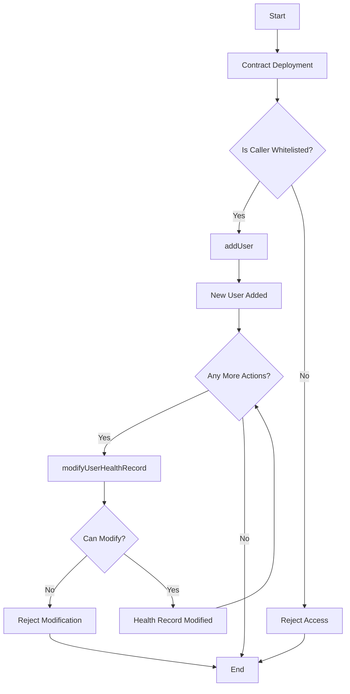

# ethglobal-istanbul23-smart-health-data

scroll contract : 0xD13DC6A66BD74008167E9c9E39F1301E02983c32

verified on blockscout sepolia scan
https://sepolia-blockscout.scroll.io/address/0xD13DC6A66BD74008167E9c9E39F1301E02983c32#code

smart contract logic : 

