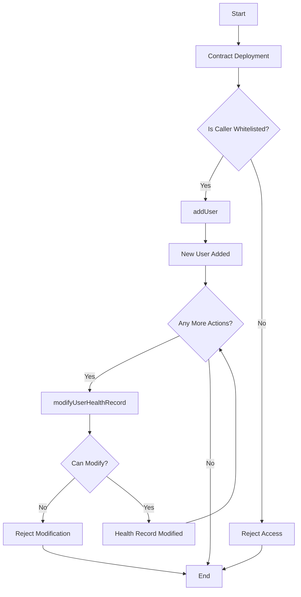

```mermaid
flowchart TD

    A[Start] --> B[Contract Deployment]

    B --> C{Is Caller Whitelisted?}
    C -- Yes --> D[addUser]
    C -- No --> E[Reject Access]

    D --> F[New User Added]
    F --> G{Any More Actions?}
    G -- Yes --> H[modifyUserHealthRecord]
    G -- No --> I[End]

    H --> J{Can Modify?}
    J -- No --> K[Reject Modification]
    J -- Yes --> L[Health Record Modified]

    L --> G

    E --> I
    K --> I

```